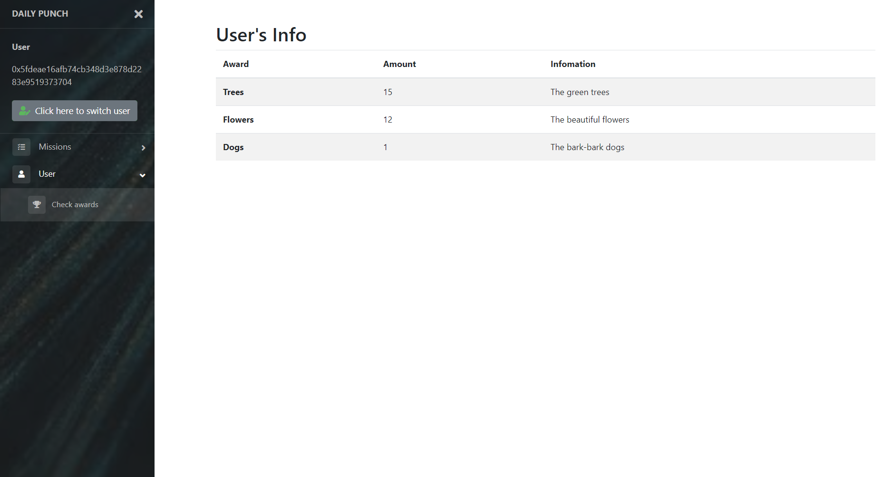

# Daily-Punching

基于区块链的一个打卡app

A daily punch app based on blockchain.

## What's Daily-Punching

这是一个每日打卡的App，基于以太坊的区块链。具体的功能有

* 发布打卡任务
* 报名任务并参与打卡
* 获取奖品

每个任务在建立时会要求声明一个奖池的合约地址，该任务会将奖品发放到这个奖池中，我在合约中默认的设置了一个奖池地址(在 **main.js** 的第一行)，如果需要改变可以直接修改源代码。

还有很多不完善的地方，主要是在逻辑上有一些漏洞，比如打卡没有时间间隔的要求等等，还请见谅。

## How to run it

首先在本地开启私链，需要如下参数

```bash
$ geth --datadir data0 --networkid 10 --port 30301 --rpc --rpcport 8545 --rpccorsdomain "*" console --rpcapi web3,db,eth,net,personal [--dev]
```

可以选择加入`--dev`参数，此参数会使得私链在发布任务时自行挖矿，方便查看。

## See the UI

进入应用界面如下，等待用户登录


输入区块链中的用户名和密码登陆后，自动切换到打卡界面。账户名会显示在左边，可点击switch按钮切换用户。


通过左侧的侧边栏切换到发布任务栏，可以发布新的打卡任务，发布成功后会提示用户保存任务的标识。


切换到打卡界面，输入刚刚的标识，搜索任务，可以搜索到刚才发布的任务


需要先Sign然后可以进行打卡，也可以选择Quit退出任务，点击后均有提示；比如不报名直接打卡时


报名后再打卡会提示成功


每次打卡会给予奖励，可以通过User->Check Awards查看



界面上借鉴了[https://github.com/azouaoui-med/pro-sidebar-template](https://github.com/azouaoui-med/pro-sidebar-template)的侧边栏界面。
